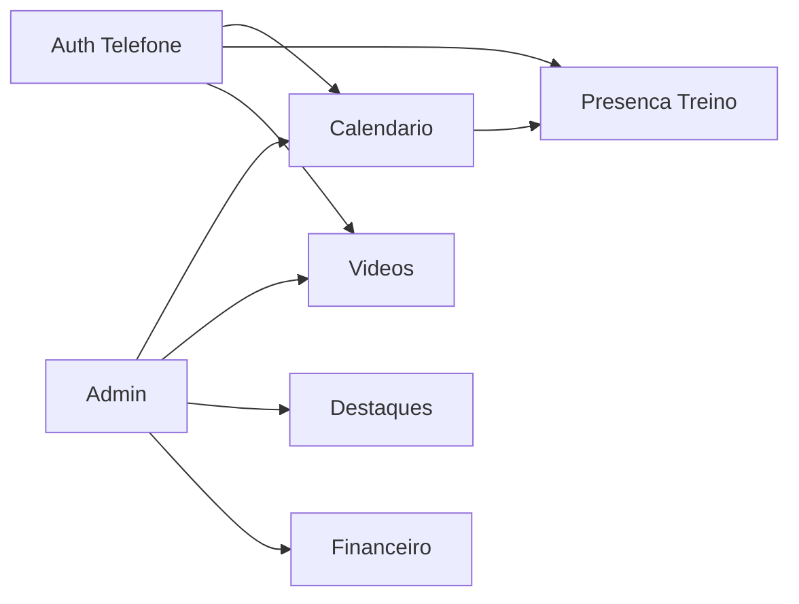

# DOMAIN.md — Siena Voleibol

Modelo de domínio em **alto nível**, derivado do export Google Stitch. Campos detalhados e regras de negócio completas serão refinados quando o responsável confirmar as specs.

---

## Context

- Clube: **A.E. Siena**
- Uso interno (~40 usuários)
- Backend como fonte de verdade; mobile consome API



---

## Bounded Areas

### Auth (Telefone)

**Observado:** login com número de telefone; termos e privacidade.

| Item | Status |
|------|--------|
| Identificação por telefone | Confirmado no Stitch |
| OTP / SMS | A definir — [ADR-0002](docs/architecture/adrs/ADR-0002-autenticacao-telefone.md) |
| Papéis (atleta vs admin) | A definir |

---

### Calendário (Eventos)

**Observado:** aba Calendário com grade mensal e lista de próximos eventos.

| Conceito | Observação no Stitch | API (implementado) |
|----------|----------------------|-------------------|
| Categoria | Masculino, Feminino, Sub-20 (UI) | **Masculino**, **Feminino** apenas (v1) |
| Tipo de evento | Liga Nacional, Treino Físico, Amistoso | Enums + labels na resposta |
| Data / hora | Ex.: 19:30, 08:00, 20:00 | `startsAt` (ISO 8601 com offset) |
| Local | Ex.: Ginásio Principal, Centro de Treinamento, Fora de Casa | `location` |
| Participantes / adversário | Ex.: "Siena vs. Minas T.C." em liga/amistoso | `opponent` (opcional) |
| Descrição | — | `description` (detalhe; opcional) |

**Endpoints:** `GET /api/events`, `GET /api/events/{id}` — leitura; seed JSON **DEV** em `apps/api/src/Siena.Infrastructure/Data/events.json`.

---

### Presença no treino

**Observado:** tela "Comparecimento no Treino".

| Conceito | Observação no Stitch |
|----------|----------------------|
| Próximo treino | Data, hora, quadra/local |
| Resposta do atleta | Eu vou / Não vou |
| Confirmados | Lista com nome + posição (Levantadora, Ponteiro, Central, Líbero) |

Regras (quem pode ver lista, prazo para confirmar, edição por coach): **a definir**.

---

### Vídeos

**Observado:** aba Vídeos — canal oficial.

| Conceito | Observação no Stitch | API (implementado) |
|----------|----------------------|-------------------|
| Título | Sim | `title` |
| Duração | Sim (ex.: 12:45) | `durationSeconds` |
| Publicado | Relativo (ex.: há 2 dias) | `publishedAt` (ISO 8601; mobile formata relativo) |
| Visualizações | Exibido na UI | `views` |
| Ação | Assistir / link externo | `url` |

**Endpoint:** `GET /api/videos` — leitura; seed JSON **DEV** em `apps/api/src/Siena.Infrastructure/Data/videos.json`.

Origem dos vídeos em produção (YouTube embed, URL manual, CMS): **a definir**.

---

### Destaques

**Status:** placeholder no export (sem `code.html`). **A definir.**

---

### Financeiro

**Status:** placeholder no export (sem `code.html`). **A definir.**

---

### Admin

**Observado:** `admin_mobile` (screenshot) e `painel_admin_web` (placeholder).

Funções esperadas (hipótese mínima, não implementar sem spec):

- Manter calendário e eventos
- Gerenciar conteúdo de vídeos/destaques
- Possível gestão financeira

Detalhe de permissões: **a definir**.

---

## API Surface

```txt
GET  /api/health          # implementado
GET  /api/events          # implementado (lista)
GET  /api/events/{id}     # implementado (detalhe; 404 se inexistente)

# Auth — após ADR-0002
POST /api/auth/...

# Presença — após ADR-0002
GET  /api/trainings/next
POST /api/trainings/{id}/attendance

GET  /api/videos          # implementado (lista)

# Admin — futuro
# ...
```

---

## Data Ownership

| Dado | Dono | Notas |
|------|------|-------|
| Eventos / calendário | Clube / admin | |
| Presenças | Atletas + visão do time | PII — LGPD |
| Telefone (login) | Atleta/usuário | ADR-0002 + SECURITY |
| Vídeos | Canal oficial / admin | Links externos prováveis |

---

## Explicitly Out of Scope (this project)

- Migração MongoDB → SQL Server (outro contexto)
- CQRS, Saga, event bus
- Placar ao vivo, rankings, documentos genéricos — **não** aparecem no Stitch deste projeto; só incluir se nova spec for fornecida
