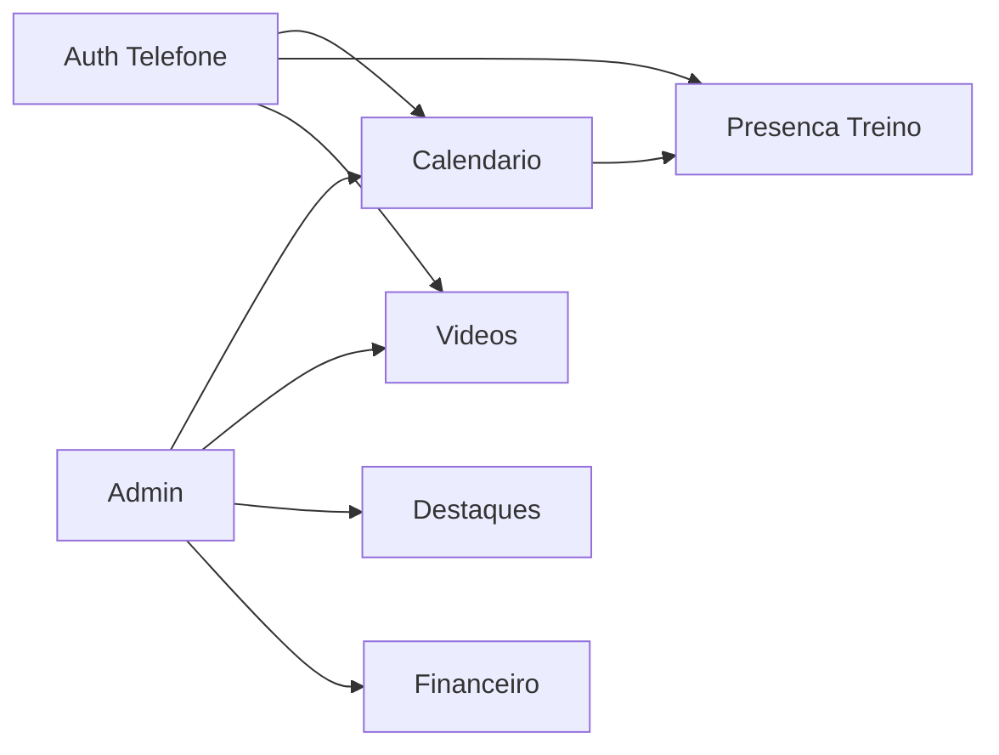

# DOMAIN.md — Siena Voleibol

Modelo de domínio em **alto nível**, derivado do export Google Stitch. Campos detalhados e regras de negócio completas serão refinados quando o responsável confirmar as specs.

---

## Context

- Clube: **A.E. Siena**
- Uso interno (~40 usuários)
- Backend como fonte de verdade; mobile consome API



---

## Bounded Areas

### Auth (Telefone)

**Observado:** login com número de telefone; termos e privacidade.

| Item | Status | API (implementado v1) |
|------|--------|----------------------|
| Identificação por telefone | Confirmado no Stitch | Allowlist PostgreSQL (`users`) |
| OTP / SMS | Follow-up — [ADR-0002](docs/architecture/adrs/ADR-0002-autenticacao-telefone.md) Accepted (v1 allowlist) | Não nesta fatia |
| Papéis | Atleta, comissão, admin | `Athlete`, `Coach`, `Admin` (labels na resposta) |
| Sessão | JWT Bearer | `POST /api/auth/login`, `GET /api/auth/me` |

**Allowlist DEV:** telefones fictícios via `DatabaseSeeder` em Development (ex.: `+5511999990001` admin).

---

### Calendário (Eventos)

**Observado:** aba Calendário com grade mensal e lista de próximos eventos.

| Conceito | Observação no Stitch | API (implementado) |
|----------|----------------------|-------------------|
| Categoria | Masculino, Feminino | **Masculino**, **Feminino** |
| Tipo de evento | Liga Nacional, Treino Físico, Amistoso | Enums + labels na resposta |
| Data / hora | Ex.: 19:30, 08:00, 20:00 | `startsAt` (ISO 8601 com offset) |
| Local | Ex.: Ginásio Principal, Centro de Treinamento, Fora de Casa | `location` |
| Participantes / adversário | Ex.: "Siena vs. Minas T.C." em liga/amistoso | `opponent` (opcional) |
| Descrição | — | `description` (detalhe; opcional) |

**Endpoints:** `GET /api/events`, `GET /api/events/{id}` — leitura; dados DEV via `DatabaseSeeder` (PostgreSQL).

---

### Presença no treino

**Observado:** tela "Comparecimento no Treino".

| Conceito | Observação no Stitch | API (implementado v1) |
|----------|----------------------|----------------------|
| Próximo treino | Data, hora, quadra/local | `GET /api/trainings/next` — evento `Treino Físico` mais próximo no futuro |
| Resposta do atleta | Eu vou / Não vou | `POST /api/trainings/{eventId}/attendance` — body `{ "status": "Eu vou" \| "Não vou" }` → grava **Pendente** |
| Aprovação | Staff aprova/rejeita | `POST /api/admin/trainings/{eventId}/attendances/{userId}/approval` — `{ "action": "approve" \| "reject" }` |
| Confirmados | Nome + posição | Lista em `confirmed` no GET next — só `Eu vou` + **Aprovado** |
| Posição | Levantadora, Ponteiro, Central, Líbero | Campo `position` em atletas (PostgreSQL) |

**Regras v1:** JWT obrigatório; apenas **Atleta** pode POST (própria resposta); edição até `startsAt`; re-marcação reseta aprovação para **Pendente**. **Administrador** e **Comissão** aprovam/rejeitam e gerenciam eventos/usuários via `/api/admin`. Prazo/notificações/coach editando presença de terceiros sem approve: **fora da v1**.

---

### Vídeos

**Observado:** aba Vídeos — canal oficial.

| Conceito | Observação no Stitch | API (implementado) |
|----------|----------------------|-------------------|
| Título | Sim | `title` |
| Duração | Sim (ex.: 12:45) | `durationSeconds` |
| Publicado | Relativo (ex.: há 2 dias) | `publishedAt` (ISO 8601; mobile formata relativo) |
| Visualizações | Exibido na UI | `views` |
| Ação | Assistir / link externo | `url` |

**Endpoint:** `GET /api/videos` — leitura; dados DEV via `DatabaseSeeder` (PostgreSQL).

Origem dos vídeos em produção (YouTube embed, URL manual, CMS): **a definir**.

---

### Destaques

**Status:** placeholder no export (sem `code.html`). **A definir.**

---

### Financeiro

**Status:** placeholder no export (sem `code.html`). **A definir.**

---

### Admin

**Observado:** `admin_mobile` (screenshot) e `painel_admin_web` (placeholder).

**API (Fase 2f — backend):** grupo `/api/admin` com policy **Staff** (`Administrador` + `Comissão`):

| Área | Endpoints |
|------|-----------|
| Eventos | `GET/POST/PUT/DELETE /api/admin/events` — CRUD todos os tipos |
| Usuários (allowlist) | `GET/POST/PUT /api/admin/users`, `PATCH .../active` — desativação preferida a exclusão |
| Presença | `GET .../attendances/pending`, `POST .../approval` |

UI mobile admin e painel web: **Fase 3/4**. CRUD vídeos/destaques/financeiro: **fora da 2f**.

---

## API Surface

```txt
GET  /api/health          # implementado
GET  /api/events          # implementado (lista)
GET  /api/events/{id}     # implementado (detalhe; 404 se inexistente)

POST /api/auth/login       # implementado (allowlist v1)
GET  /api/auth/me          # implementado (JWT Bearer)

GET  /api/trainings/next              # implementado (JWT; inclui myApprovalStatus)
POST /api/trainings/{id}/attendance   # implementado (JWT; só Atleta → Pendente)

GET  /api/videos          # implementado (lista)

GET    /api/admin/events
POST   /api/admin/events
PUT    /api/admin/events/{id}
DELETE /api/admin/events/{id}
GET    /api/admin/users
POST   /api/admin/users
PUT    /api/admin/users/{id}
PATCH  /api/admin/users/{id}/active
GET    /api/admin/trainings/{eventId}/attendances/pending
POST   /api/admin/trainings/{eventId}/attendances/{userId}/approval
# (todos Staff — JWT)
```

---

## Data Ownership

| Dado | Dono | Notas |
|------|------|-------|
| Eventos / calendário | Clube / admin | |
| Presenças | Atletas + visão do time | PII — LGPD |
| Telefone (login) | Atleta/usuário | ADR-0002 + SECURITY |
| Vídeos | Canal oficial / admin | Links externos prováveis |

---

## Explicitly Out of Scope (this project)

- Migração MongoDB → SQL Server (outro contexto)
- CQRS, Saga, event bus
- Placar ao vivo, rankings, documentos genéricos — **não** aparecem no Stitch deste projeto; só incluir se nova spec for fornecida
