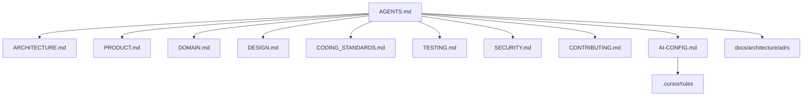

# Migration Plan — Portfolio → Siena Voleibol

Plano de migração de **documentação e disciplina de engenharia** do Portfolio para o hub interno **A.E. Siena**, com produto definido pelo export **Stitch** (`stitch_siena_voleibol_digital_hub.zip`).

> **Sem código ainda.** Backend será o primeiro código. Mobile: React Native.

---

## 1. Objetivos

| Objetivo | Status |
|----------|--------|
| Ecossistema de docs + IA (AGENTS, ARCHITECTURE, AI-CONFIG, …) | Concluído |
| Contexto real do Stitch (não lista genérica de features) | Concluído |
| Descartar confusão Grok (enterprise / Mongo migration) | Concluído |
| Implementação backend (fundação) | Concluída (Fase 2a) |
| Implementação backend (domínio) | Parcial (Fase 2b: events + videos) |
| Implementação mobile | Pendente |

---

## 2. Matriz — o que veio de onde

### Do Portfolio (reutilizar)

- Clean Architecture em 4 projetos .NET
- Disciplina de IA → `AGENTS.md` + `AI-CONFIG.md` + `.cursor/rules`
- JSON seed → repositório
- Docker Compose para API
- xUnit, Conventional Commits, ADRs

### Do Stitch (produto Siena)

- Login telefone, Calendário, Presença, Vídeos
- Tabs Financeiro / Destaques (placeholder)
- Admin mobile + painel web (web placeholder)
- `DESIGN.md` (identidade A.E. Siena)

### Do rascunho Grok (descartar)

- Plannera, migração MongoDB→SQL, CQRS, Saga, K8s, Blazor
- Papéis Grok/Leba/Tai/Corvo
- Lista genérica: placar ao vivo, rankings, documentos, inscrições (não estão no Stitch deste projeto)

---

## 3. Fases

### Fase 0 — Documentação e ecossistema IA (CONCLUÍDA)

- [x] `ARCHITECTURE.md`, `AI-CONFIG.md`, `PROJECT-STRUCTURE.md`, `MIGRATION-PLAN.md`
- [x] `AGENTS.md`, `PRODUCT.md`, `DOMAIN.md`, `DESIGN.md`
- [x] `CODING_STANDARDS.md`, `TESTING.md`, `SECURITY.md`, `CONTRIBUTING.md`
- [x] `.cursor/rules/` (6 arquivos)
- [x] `docs/architecture/adrs/ADR-0001` (React Native), `ADR-0002` (auth telefone — Proposed), `ADR_TEMPLATE.md`

### Fase 1 — Specs complementares (humano)

- [ ] Definir **Financeiro** e **Destaques**
- [ ] Aprovar **ADR-0002** (OTP / allowlist / sessão)
- [ ] Textos legais (termos, privacidade)
- [ ] Detalhar permissões admin

### Fase 2a — Backend foundation (CONCLUÍDA)

- [x] Scaffold `apps/api` (Siena.Api, Application, Domain, Infrastructure)
- [x] `GET /api/health`, root, OpenAPI + Scalar, CORS
- [x] Testes: HealthEndpointTests, OpenApiEndpointTests, DependencyInjectionTests
- [x] `docker-compose.yml`, `.env.example`, `README.md`, `global.json`, Dockerfile
- [x] `dotnet build` / `dotnet test` — 3 testes passando

```bash
dotnet build apps/api/Siena.slnx
dotnet test apps/api/Siena.slnx
```

Docker: arquivos criados; **validação não executada** (Docker ausente no ambiente).

### Fase 2b — Backend domínio (parcialmente concluída)

- [x] Endpoints: `GET /api/events`, `GET /api/events/{id}`, `GET /api/videos` (leitura + seed JSON DEV)
- [x] Testes: EventsEndpointTests, VideosEndpointTests; OpenAPI atualizado
- [x] `dotnet build` / `dotnet test` — 7 testes passando
- [ ] Presença e auth — após ADR-0002

### Fase 3 — Mobile React Native

- [ ] Scaffold `apps/mobile`
- [ ] Tema DESIGN.md
- [ ] Tabs + telas Stitch (auth, calendário, presença, vídeos)
- [ ] Cliente API

### Fase 4 — Admin web + polish

- [ ] `apps/admin-web` simples (se necessário)
- [ ] Auth completo pós ADR-0002
- [ ] CI básico

---

## 4. Ecossistema de arquivos (mapa)



---

## 5. Próximas ações

1. Você: specs de Financeiro/Destaques + decisão ADR-0002
2. Opus: refinar contratos de API quando specs existirem
3. AUTO: Fase 3 mobile scaffold (quando autorizado); presença/auth após ADR-0002

---

## 6. Referências

- Fonte engenharia: `C:\Users\lucas\Documents\Projects\Portfolio`
- Destino: `C:\Users\lucas\Documents\Projects\Siena`
- Visual: `stitch_siena_voleibol_digital_hub.zip`
