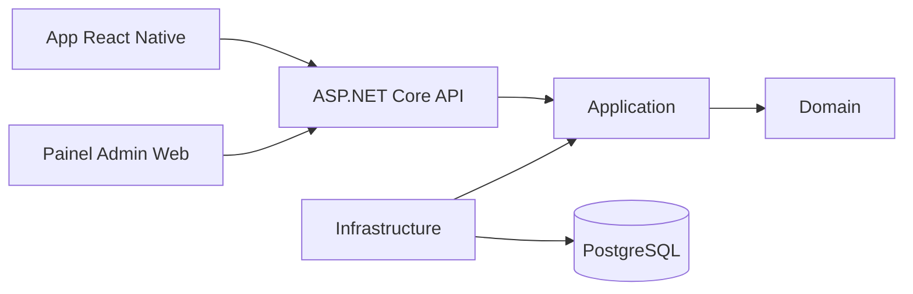

# Architecture — Siena Voleibol

Arquitetura do hub digital interno da **A.E. Siena**. Referência de engenharia: monorepo **Portfolio** (Clean Architecture pragmática). Referência de produto: export Google Stitch (`stitch_siena_voleibol_digital_hub.zip`).

> **Escala:** ~40 usuários internos, tráfego leve. **Simplicidade** é requisito, não opcional. Ver [OVERENGINEERING.md](OVERENGINEERING.md).

---

## Product context

| Item | Valor |
|------|-------|
| App | Siena Voleibol — gestão e desempenho do time |
| Users | Atletas, comissão, admin (~40) |
| Mobile | React Native + TypeScript ([ADR-0001](adrs/ADR-0001-mobile-stack.md)) |
| Backend | .NET LTS, ASP.NET Core — **desenvolvido primeiro** |
| Admin | Painel web simples + admin mobile (mesma API) |
| Design | [DESIGN.md](../product/DESIGN.md) |

### Features (from Stitch)

- Login por telefone ([ADR-0002](adrs/ADR-0002-autenticacao-telefone.md) — Accepted)
- Tabs: Financeiro (*a definir*), Calendário, Destaques (*a definir*), Vídeos
- Presença no treino (Eu vou / Não vou)
- Admin (mobile + web)

Ver [PRODUCT.md](../product/PRODUCT.md) e [DOMAIN.md](DOMAIN.md).

### Explicitly out of scope

Padrões de **outro contexto** (ex. rascunho enterprise) que **não** se aplicam:

- Migração MongoDB → SQL Server em alto volume
- CQRS, Saga, event-driven, Outbox, microserviços
- Kubernetes, mutation/load testing enterprise, Blazor

---

## Target monorepo

```txt
/
  apps/
    api/              # 1º — ASP.NET Core
    mobile/           # 2º — React Native
    admin-web/        # futuro — painel admin
  docs/
    architecture/adrs/
  .cursor/rules/
  stitch_siena_voleibol_digital_hub.zip   # referência visual
  AGENTS.md
  ARCHITECTURE.md
  DESIGN.md
  DOMAIN.md
  PRODUCT.md
  docker-compose.yml
```

---

## System diagram



---

## Backend (Clean Architecture — pragmatic)

```txt
Siena.Api
  Endpoints, OpenAPI/Scalar, CORS, composition

Siena.Application
  Use cases, DTOs, service interfaces

Siena.Domain
  Domain models, enums — no infrastructure deps

Siena.Infrastructure
  EF Core + PostgreSQL, repositories, external services (SMS later)
```

Dependency direction:

```txt
Api -> Application
Api -> Infrastructure
Infrastructure -> Application
Infrastructure -> Domain
Application -> Domain
Domain -> (none outward)
```

### Endpoint groups (implementados)

| Group | Purpose |
|-------|---------|
| Health | Liveness |
| Auth | Login JWT + allowlist ([ADR-0002](adrs/ADR-0002-autenticacao-telefone.md)) |
| Events | Calendar |
| Attendance | Training presence |
| Videos | Official channel list |
| Admin | Content management |

---

## Mobile

- Feature folders: `auth`, `calendar`, `attendance`, `videos`, etc.
- Theme from [DESIGN.md](../product/DESIGN.md) (`#E30613`, Inter)
- API client typed to backend DTOs
- Bottom tabs matching Stitch: Financeiro, Calendário, Destaques, Vídeos

---

## Data strategy

1. **Atual:** **PostgreSQL** + EF Core — [ADR-0003](adrs/ADR-0003-persistencia-postgresql.md); seed via `DatabaseSeeder`
2. **Dev:** `docker-compose.yml` (API + PostgreSQL)
3. **Testes:** SQLite in-memory via `Persistence:Provider=Sqlite`
4. **Legado:** repositórios JSON removidos ([ADR-0003](adrs/ADR-0003-persistencia-postgresql.md)); EF Core + PostgreSQL é a fonte de verdade
5. **PII:** phone, attendance — revisão LGPD humana antes de produção ([SECURITY.md](../../SECURITY.md))

---

## Infrastructure (dev)

- `docker-compose.yml`: API + PostgreSQL
- Mobile runs on host emulator/device
- `.env.example` for API URLs and CORS

---

## Architectural guardrails

- No microservices, CQRS, Saga, Outbox or event-bus
- No `packages/shared` until real duplication
- DTOs at API boundary; serviços explícitos (sem MediatR por padrão)
- ADR before: new database, auth provider, messaging layer or major lib
- Preserve API contracts unless breaking change approved
- Proporcionalidade: [OVERENGINEERING.md](OVERENGINEERING.md)

---

## Reuse from Portfolio

| Portfolio | Siena |
|-----------|-------|
| 4-layer .NET structure | Reuse |
| Endpoint groups + xUnit | Reuse |
| JSON repository pattern | Legado — substituído por EF Core |
| Next.js `apps/web` | Replace with React Native |
| Stitch portfolio export | Replace with Siena Stitch + DESIGN.md |

---

## ADRs

| ADR | Topic |
|-----|-------|
| [0001](adrs/ADR-0001-mobile-stack.md) | React Native — Accepted |
| [0002](adrs/ADR-0002-autenticacao-telefone.md) | Phone auth / JWT — Accepted |
| [0003](adrs/ADR-0003-persistencia-postgresql.md) | PostgreSQL + EF Core — Accepted |
| [0004](adrs/ADR-0004-mobile-expo-router.md) | Mobile Expo Router — Accepted |
| TBD | Admin web stack |
| TBD | Financeiro / Destaques when specced |

---

## References

- Portfolio: `C:\Users\lucas\Documents\Projects\Portfolio\ARCHITECTURE.md`
- Portfolio implementation: `apps/api/src/`
