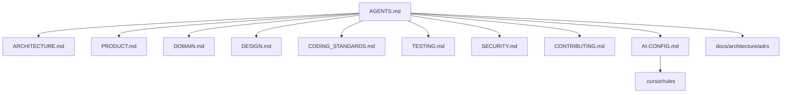

# Migration Plan — Portfolio → Siena Voleibol

Plano de migração de **documentação e disciplina de engenharia** do Portfolio para o hub interno **A.E. Siena**, com produto definido pelo export **Stitch** (`stitch_siena_voleibol_digital_hub.zip`).

> **Backend e mobile em implementação.** Log histórico da migração Portfolio → Siena; estrutura atual: [README.md](../../README.md) e [docs/architecture/ARCHITECTURE.md](../architecture/ARCHITECTURE.md).

---

## 1. Objetivos

| Objetivo | Status |
|----------|--------|
| Ecossistema de docs + IA (AGENTS, ARCHITECTURE, AI-CONFIG, …) | Concluído |
| Contexto real do Stitch (não lista genérica de features) | Concluído |
| Descartar confusão Grok (enterprise / Mongo migration) | Concluído |
| Implementação backend (fundação) | Concluída (Fase 2a) |
| Implementação backend (domínio) | Concluída (2b–2f + Postgres) |
| Implementação mobile | Em andamento (Fase 3 — fluxos core + admin) |

---

## 2. Matriz — o que veio de onde

### Do Portfolio (reutilizar)

- Clean Architecture em 4 projetos .NET
- Disciplina de IA → `AGENTS.md` + `AI-CONFIG.md` + `.cursor/rules`
- PostgreSQL + EF Core (Docker Compose)
- Docker Compose para API
- xUnit, Conventional Commits, ADRs

### Do Stitch (produto Siena)

- Login telefone, Calendário, Presença, Vídeos
- Tabs Financeiro / Destaques (placeholder)
- Admin mobile + painel web (web placeholder)
- `DESIGN.md` (identidade A.E. Siena)

### Do rascunho Grok (descartar)

- Plannera, migração MongoDB→SQL, CQRS, Saga, K8s, Blazor
- Papéis Grok/Leba/Tai/Corvo
- Lista genérica: placar ao vivo, rankings, documentos, inscrições (não estão no Stitch deste projeto)

---

## 3. Fases

### Fase 0 — Documentação e ecossistema IA (CONCLUÍDA)

- [x] `ARCHITECTURE.md`, `AI-CONFIG.md`, `PROJECT-STRUCTURE.md`, `MIGRATION-PLAN.md`
- [x] `AGENTS.md`, `PRODUCT.md`, `DOMAIN.md`, `DESIGN.md`
- [x] `CODING_STANDARDS.md`, `TESTING.md`, `SECURITY.md`, `CONTRIBUTING.md`
- [x] `.cursor/rules/` (6 arquivos)
- [x] `docs/architecture/adrs/ADR-0001` (React Native), `ADR-0002` (auth telefone — Accepted), `ADR_TEMPLATE.md`

### Fase 1 — Specs complementares (humano)

- [ ] Definir **Financeiro** e **Destaques**
- [x] **ADR-0002** v1 (allowlist + JWT) — Accepted
- [ ] OTP/SMS em produção (follow-up ADR)
- [ ] Textos legais (termos, privacidade)
- [ ] Detalhar permissões admin

### Fase 2a — Backend foundation (CONCLUÍDA)

- [x] Scaffold `apps/api` (Siena.Api, Application, Domain, Infrastructure)
- [x] `GET /api/health`, root, OpenAPI + Scalar, CORS
- [x] Testes: HealthEndpointTests, OpenApiEndpointTests, DependencyInjectionTests
- [x] `docker-compose.yml`, `.env.example`, `README.md`, `global.json`, Dockerfile
- [x] `dotnet build` / `dotnet test` — 3 testes passando

```bash
dotnet build apps/api/Siena.slnx
dotnet test apps/api/Siena.slnx
```

Docker: arquivos criados; **validação não executada** (Docker ausente no ambiente).

### Fase 2b — Backend domínio (parcialmente concluída)

- [x] Endpoints: `GET /api/events`, `GET /api/events/{id}`, `GET /api/videos` (leitura + PostgreSQL)
- [x] Testes: EventsEndpointTests, VideosEndpointTests; OpenAPI atualizado
- [x] `dotnet build` / `dotnet test` — 7 testes passando
### Fase 2c — Autenticação (CONCLUÍDA)

- [x] Allowlist v1 + JWT: `POST /api/auth/login`, `GET /api/auth/me`
- [x] Allowlist DEV via `DatabaseSeeder`; `AuthEndpointTests`
- [x] ADR-0002 Accepted; `dotnet test` — 11 testes passando

### Fase 2e — Persistência PostgreSQL (CONCLUÍDA)

- [x] ADR-0003 Accepted; EF Core + Npgsql
- [x] `SienaDbContext`, migration `InitialCreate`, repositórios EF
- [x] Docker Compose com serviço `postgres`
- [x] Testes com SQLite in-memory (`SienaWebApplicationFactory`)
- [x] `dotnet test` — ver Fase 2f

### Fase 2d — Presença no treino (CONCLUÍDA)

- [x] `GET /api/trainings/next`, `POST /api/trainings/{id}/attendance` (JWT; POST só Atleta)
- [x] Persistência em PostgreSQL (`attendances`)
- [x] Testes: `TrainingEndpointTests`

### Fase 2f — Admin API (CONCLUÍDA)

- [x] CRUD eventos e usuários (allowlist) em `/api/admin` — policy **Staff**
- [x] Fluxo presença em dois passos: atleta → Pendente; staff approve/reject; `confirmed` só Aprovado
- [x] `UserAccount.IsActive`; migration `AddAttendanceApprovalAndUserIsActive`
- [x] Testes: `AdminEventsEndpointTests`, `AdminUsersEndpointTests`, `AdminAttendanceApprovalTests`
- [x] `dotnet test` — suite de integração API passando

### Fase 3 — Mobile React Native (EM ANDAMENTO)

- [x] Scaffold `apps/mobile` (Expo + Expo Router — ADR-0004)
- [x] Tema DESIGN.md (`src/theme`)
- [x] Tabs: Financeiro (placeholder), Calendário, Vídeos; login; presença; admin mobile (Staff)
- [x] Cliente API (`src/api`, JWT secure-store)
- [ ] Destaques (adiado)
- [x] Admin: criar/editar/excluir eventos, aprovar presenças, contagem pendentes
- [x] Admin: criar/editar/ativar-desativar usuários

### Fase 4 — Admin web + polish

- [ ] `apps/admin-web` simples (se necessário)
- [ ] OTP/SMS e refresh token (follow-up ADR)
- [x] CI básico (`.github/workflows/ci.yml`)

---

## 4. Ecossistema de arquivos (mapa)



---

## 5. Próximas ações

1. Você: specs de Financeiro/Destaques; textos legais (termos/privacidade)
2. Smoke manual mobile + Expo Go contra API DEV
3. Gate humano: limites de rate limit / AllowedHosts em produção

---

## 6. Referências

- [AGENTS.md](../../AGENTS.md)
- [ARCHITECTURE.md](../architecture/ARCHITECTURE.md)
- [DOMAIN.md](../architecture/DOMAIN.md)
- [PRODUCT.md](../product/PRODUCT.md)
- [AI-CONFIG.md](../ai/AI-CONFIG.md)
- [OVERENGINEERING.md](../architecture/OVERENGINEERING.md)

- Fonte engenharia: `C:\Users\lucas\Documents\Projects\Portfolio`
- Destino: `C:\Users\lucas\Documents\Projects\Siena`
- Visual: `stitch_siena_voleibol_digital_hub.zip`
